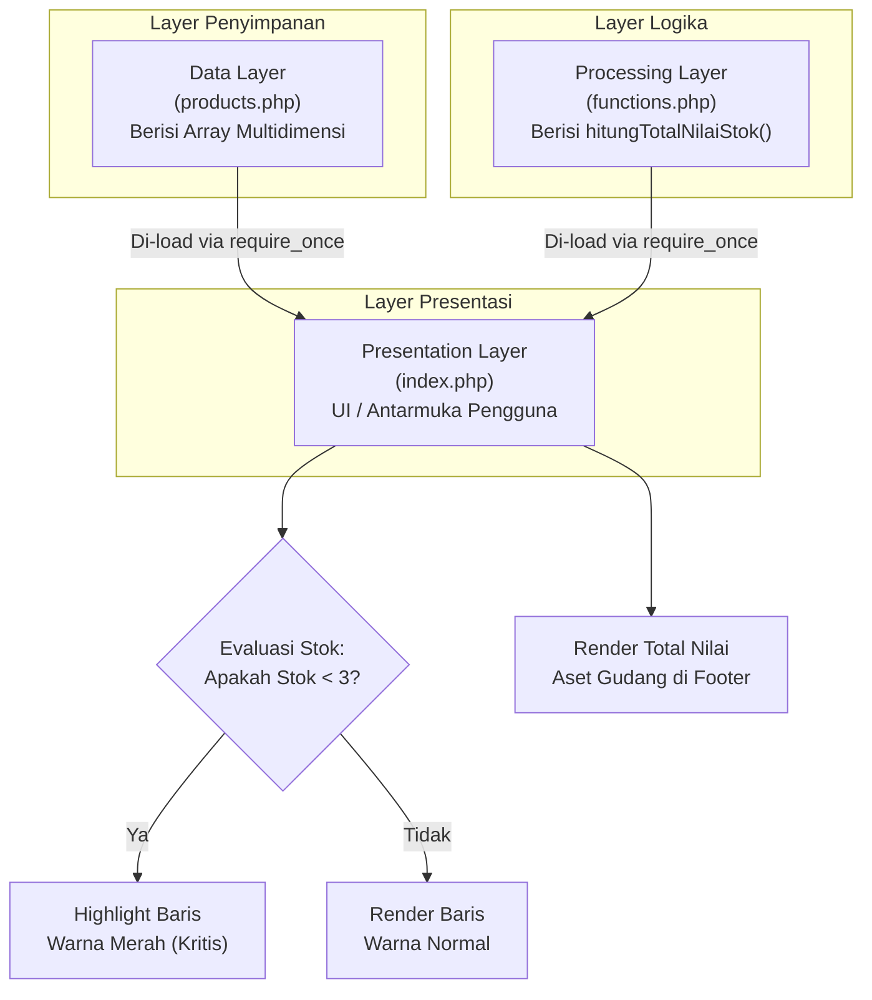

# Detail Flowchart & Alur Logika Eksekusi (Procedural Flow)

Dokumen ini merupakan turunan dari Product Requirements Document (PRD) yang berfokus pada visualisasi dan penjelasan teknis mengenai bagaimana sistem mengalirkan data dan mengeksekusi logika bisnis secara prosedural.

---

### 1. Diagram Arsitektur Komponen (High-Level Flowchart)

Diagram di bawah ini mengilustrasikan bagaimana ketiga layer utama (Data, Processing, dan Presentation) saling berinteraksi. Sesuai prinsip *Separation of Concerns*, `index.php` bertindak sebagai pusat perakitan yang menarik data dan fungsi dari layer lainnya.

**Penjelasan Arsitektur:**
*   **Arah Panah:** Menunjukkan aliran ketergantungan (dependency). `index.php` bergantung pada eksistensi `products.php` (untuk data) dan `functions.php` (untuk logika hitung).
*   **Kondisional:** Logika penentuan warna baris (*styling*) dilakukan saat rendering di `index.php` berdasarkan evaluasi nilai properti stok dari data yang ditarik.

---

### 2. Penjelasan Langkah Eksekusi (Step-by-Step)

Berdasarkan diagram di atas, berikut adalah narasi eksekusinya:

1.  **Request Masuk:** Siklus dimulai ketika pengguna mengakses URL proyek di browser. Server web (seperti Apache/Nginx) akan mengeksekusi file `index.php`.
2.  **Impor Komponen (Fase 1):** Baris pertama di `index.php` wajib menggunakan `require_once` untuk memuat `products.php`. Ini memindahkan *hard-coded array* produk ke dalam memori eksekusi saat ini. Setelah itu, `functions.php` juga diimpor.
3.  **Kalkulasi Aset (Fase 2):** Sebelum tabel HTML digambar, `index.php` akan memanggil fungsi `hitungTotalNilaiStok($products)`. Fungsi ini (yang berada di layer terpisah) akan menelusuri array, mengalikan `Harga * Stok` per produk, menyimpannya di variabel akumulator, dan mengembalikan hasil akhir (*return value*).
4.  **Proses Looping Tabel (Fase 3):** `index.php` mulai merender kode HTML standar. Saat mencapai bagian `<tbody>` dari tabel, struktur kontrol `foreach` diaktifkan untuk membaca array produk satu per satu.
5.  **Evaluasi Stok Kritis (Fase 3 Lanjutan):** Di dalam perulangan `foreach`, sistem PHP mengecek: `if ($produk['stok'] < 3)`. 
    *   Jika **TRUE**, PHP menyisipkan *class CSS* peringatan (misal: warna background atau teks merah) ke dalam tag `<tr>`.
    *   Jika **FALSE**, baris di-render secara normal.
6.  **Finalisasi & Response:** Setelah tabel selesai diloop, hasil perhitungan total aset dicetak. PHP selesai mengeksekusi *script*, lalu mengirimkan dokumen HTML mentah secara penuh (*rendered*) kembali ke *Browser* pengguna.