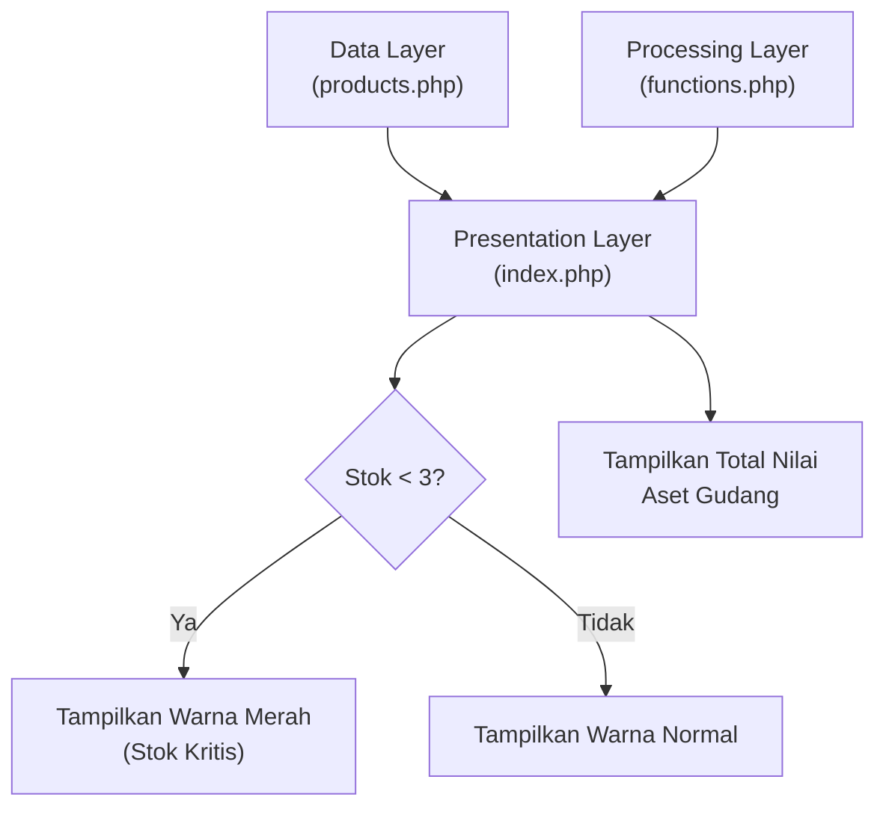

# Product Requirements Document (PRD) & Perencanaan Proyek
## Mini Project 1: Product Information System (Desain)

### 1. Pendahuluan
**Tujuan Proyek:** 
Merancang struktur blueprints sistem manajemen data informasi produk siap pakai berbasis konsep teori arsitektur berlapis (layered architecture). Fase ini difokuskan penuh pada pematangan cetak biru konsep arsitektur desain secara logis (merupakan sesi **Tanpa Coding**).

### 2. Batasan Fitur (Out of Scope / Limitations)
Untuk menjaga agar proyek tetap fokus pada tujuan pembelajaran arsitektur dasar, berikut adalah batasan-batasan fitur pada sistem ini:
*   **Tanpa Database Relasional:** Data tidak disimpan dalam database sungguhan (seperti MySQL/PostgreSQL), melainkan *hard-coded* di dalam bentuk Array PHP multidimensi.
*   **Hanya Read-Only (Tanpa CRUD):** Tidak ada antarmuka atau formulir (form) untuk menambah (Create), mengedit (Update), atau menghapus (Delete) produk. 
*   **Tanpa Interaktivitas Klien Lanjutan:** Tidak menggunakan JavaScript untuk interaksi di sisi klien (seperti *live search* atau *sorting* kolom tabel). Semua proses bisnis dan *rendering* dirender seutuhnya oleh PHP di sisi server.
*   **Hanya 3 Layer Sederhana:** Sistem diwajibkan hanya dibagi ke dalam tiga file spesifik (`products.php`, `functions.php`, `index.php`) sesuai dengan batas instruksi komponen arsitektur pada gambar.

### 3. Arsitektur Sistem (Conceptual Design)
Sistem ini menggunakan arsitektur 3-tier (Tiga Lapis) sederhana yang dipecah ke dalam 3 berkas (file) terpisah untuk menjaga *Separation of Concerns* (pemisahan tanggung jawab).

### 3.1. Alur Kerja & Diagram Arsitektur (Flowchart)
Berikut adalah gambaran alur kerja dan hubungan antar-komponen dalam sistem:

#### 3.2. Data Layer (`products.php`)
Layer ini bertindak sebagai basis data tiruan (mock database).
*   **Struktur Penyimpanan:** *Multidimensional Array* di dalam PHP.
*   **Entitas Data Produk yang Disimpan:**
    1.  `ID` (Karakter unik/angka)
    2.  `Nama` (Nama komoditas produk)
    3.  `Kategori` (Jenis/kelompok produk)
    4.  `Harga` (Harga satuan produk)
    5.  `Stok` (Jumlah ketersediaan produk)
    6.  `Deskripsi` (Penjelasan singkat mengenai produk)

#### 3.3. Processing Layer (`functions.php`)
Layer ini difokuskan sebagai tempat menyimpan seluruh logika bisnis (*business logic*) dan fungsi pemrosesan data, terpisah dari data inti dan antarmuka pengguna.
*   **Fungsi Kalkulasi Aset (`hitungTotalNilaiStok()`):** Sebuah fungsi yang dirancang untuk menghitung total nilai aset produk di gudang. Secara logis, fungsi ini akan melakukan iterasi pada setiap produk, mengalikan nilai `Harga` dengan `Stok` pada masing-masing produk, dan menjumlahkan total akhirnya.
*   **Logika Kondisional Keamanan Stok:** Terdapat logika untuk mengevaluasi kelayakan jumlah stok. Jika jumlah stok suatu produk di bawah batas aman (yaitu **< 3**), fungsi ini akan memberikan penanda status khusus (biasanya digunakan untuk mengubah warna baris tabel di layar presentasi agar menjadi perhatian).

#### 3.4. Presentation Layer (`index.php`)
Layer ini bertindak sebagai *User Interface* (UI) yang bertugas merajut seluruh komponen sistem dan menampilkannya kepada pengguna akhir di *browser*.
*   **Integrasi Komponen:** File ini akan menggunakan instruksi `require_once` untuk memuat memori data dari `products.php` dan mengaktifkan fungsi operasional dari `functions.php` agar tidak terjadi duplikasi pemuatan.
*   **Mekanisme Rendering (Perulangan `foreach`):** Data *multidimensional array* dari layer data akan ditelusuri menggunakan struktur perulangan *foreach*. Setiap siklus perulangan akan mencetak data (ID, Nama, Harga, dll.) ke dalam struktur baris dan kolom tabel HTML konvensional.
*   **Visualisasi Stok Kritis:** Menerapkan hasil kalkulasi dari *Processing Layer* untuk menyaring baris tabel. Baris yang menampilkan data produk dengan stok < 3 akan di-render dengan atribut kelas *styling* spesifik (warna berbeda) untuk menyoroti urgensi.